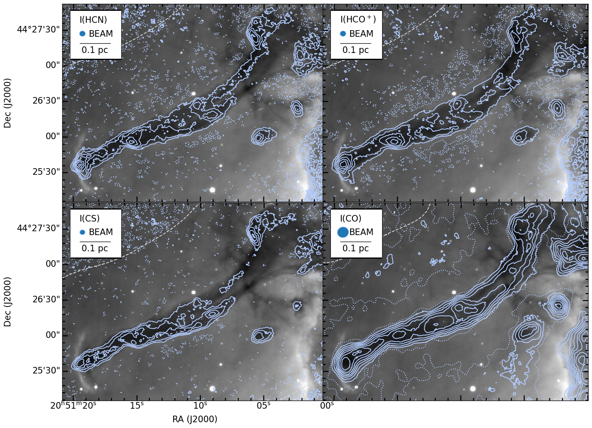

# Project GBT25B-386

Scripts and other files for the GBT  Pelican Nebula observing project

## Observation Overview

Integrated intensity maps of the Pelican pillar in the 4 species requested in this proposal, as observed with CARMA/BIMA interferometers. Light blue solid contours are in 3,7,11...× (HCN, HCO+: 50 mJy beam−1 km s−1; CS: 30 mJy beam−1 km s−1; CO: 750 mJy beam−1 km s−1). Dotted light blue contours (-1.5 times each map RMS) show negative artifacts due to missing zero-spacings, which GBT data can improve. The synthesized beams are shown in blue in the upper left corners. Dashed gray line is a contour of fixed sensitivity from the primary beam mosaic pattern; outside this contour the sensitivity falls off (noise increases). Grayscale is Hα image from Bally and Reipurth (2003).

The GBT observations are to obtain zero spacing data and will cover roughly 5 arcmin x 4 arcmin.

